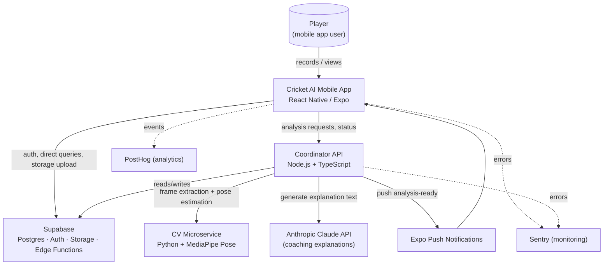
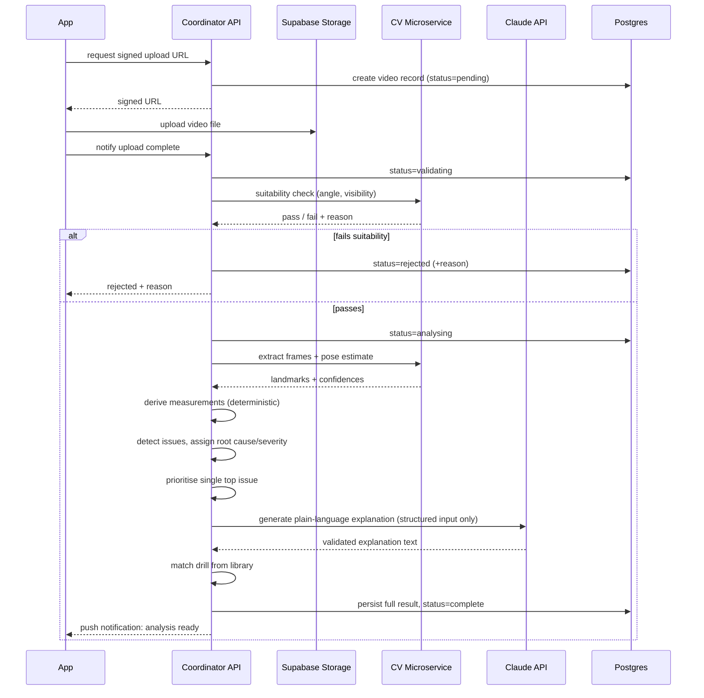

# 03 — System Architecture

**Status:** Draft v1 — **contains architectural assumptions requiring your sign-off before implementation begins.**
**Depends on:** [02-software-requirements.md](./02-software-requirements.md)
**Feeds into:** [04-database.md](./04-database.md), [05-api.md](./05-api.md), [06-ai-architecture.md](./06-ai-architecture.md), [07-computer-vision.md](./07-computer-vision.md)

---

## 0. Assumptions Requiring Validation

No code has been written yet, and no infrastructure account exists. The stack below is a recommendation chosen to fit the requirements in [02-software-requirements.md](./02-software-requirements.md) (in particular row-level security in [04-database.md](./04-database.md), mobile-first delivery, and a modest initial scale). **Confirm or override before implementation starts:**

1. **Backend platform: Supabase** (managed Postgres + Auth + Storage + Edge Functions), rather than a fully custom backend or another BaaS (Firebase). Chosen for Postgres row-level security, fast MVP velocity, and SQL-native data modelling that suits the coaching engine's relational structure (skills → issues → drills).
2. **Mobile client: React Native via Expo, TypeScript.** Chosen over native iOS/Android for single-codebase velocity at MVP stage, and over a web app because video recording is the core interaction and needs native camera access.
3. **Pose estimation: self-hosted MediaPipe Pose** (Google, open-source) in a dedicated Python microservice, rather than a paid third-party CV API. Chosen because it's free, well-validated for body landmark tracking, and keeps player video inside our own infrastructure rather than a third-party vendor. See [07-computer-vision.md](./07-computer-vision.md) for the honest capability breakdown.
4. **Coaching language layer: Anthropic Claude API** for explanation/narrative generation only — never for measurement or diagnosis (those are deterministic; see [06-ai-architecture.md](./06-ai-architecture.md)).
5. **Async job handling: Postgres-backed job table + worker polling**, not a separate managed queue, at MVP scale. Simple, no new infra, sufficient for expected v1 volume; explicitly called out as the first thing to replace if volume grows (§12).

If any of these conflict with an existing technical direction, org standard, or vendor relationship, flag it now — the rest of this document, and every downstream doc, assumes this stack.

**Update:** Assumptions 1–4 above are confirmed, per the full head-to-head evaluation in [13-technology-decisions.md](./13-technology-decisions.md). That document also resolves the one hosting question §14 below still leaves open in its "final choice not yet made" wording — see the update note there.

## 1. System Context

## 2. Frontend

**React Native (Expo), TypeScript.** Single codebase for iOS and Android.

- Navigation: file-based routing (Expo Router).
- State/data: server state via a query/cache layer (e.g. TanStack Query) against the Coordinator API and Supabase client SDK; local UI state kept minimal and colocated.
- Video capture: Expo Camera module with a custom overlay for side-on framing guidance (SR-VID-001).
- Direct-to-storage upload: the app requests a signed upload URL from the Coordinator API and uploads the video file straight to Supabase Storage — video bytes never pass through the Coordinator API (SR-VID-003).
- Design system implementation per [10-design-system.md](./10-design-system.md).

## 3. Backend

Two backend components, deliberately separated by responsibility:

**a) Supabase** — system of record and identity.
- Postgres database (schema in [04-database.md](./04-database.md)).
- Supabase Auth (email/password + OAuth) — SR-AUTH-001/002.
- Supabase Storage — video files, with row-level-security-governed access.
- Row-Level Security policies enforce that a player can only read/write their own rows — the primary authorisation mechanism, not just an application-layer check (defence in depth).
- Supabase Realtime (optional, MVP-nice-to-have) to push processing-status updates to the client instead of polling (SR-VID-005).

**b) Coordinator API** — Node.js + TypeScript service (e.g. Fastify), stateless, deployed independently.
- Owns the video processing pipeline orchestration: validation → frame extraction → pose estimation → measurement → diagnosis → explanation → drill matching → persistence.
- Owns all calls to the CV microservice and Claude API — these credentials never reach the client.
- Exposes the REST API defined in [05-api.md](./05-api.md).
- Reads/writes Postgres via the same schema, using a service role scoped narrowly to what the pipeline needs (not a blanket bypass of RLS).

> **Why not put everything in Supabase Edge Functions?** Edge Functions (Deno) are well-suited to short, simple operations, but the video pipeline involves a Python CV microservice call, multi-step orchestration, and needs to run longer than a typical edge function budget comfortably allows. A dedicated service gives clearer control over retries, timeouts, and cost tracking (NFR-08). This is one of the assumptions in §0 to confirm.

## 4. Database

Postgres via Supabase. Full schema in [04-database.md](./04-database.md). Row-Level Security is the primary data-isolation mechanism between players.

## 5. Authentication

Supabase Auth: email/password + Apple/Google OAuth (SR-AUTH-001/002). JWTs issued by Supabase are verified by both the Supabase client (RLS-governed direct queries) and the Coordinator API (bearer token, verified via Supabase's JWKS endpoint). See [11-security.md](./11-security.md) for token lifetime and revocation detail.

## 6. File Storage

Supabase Storage (S3-compatible), two buckets:
- `videos-raw` — private, RLS-scoped to the owning player; original uploaded video.
- `videos-processed` (optional, post-MVP) — derived clips (e.g. contact-frame thumbnail) for UI use.

Signed, time-limited URLs are used for both upload (client → storage) and playback (storage → client). No public bucket access.

## 7. Video Processing

Orchestrated by the Coordinator API as a pipeline of discrete, resumable stages, tracked in a `processing_jobs` table (see [04-database.md](./04-database.md)):

Each stage writes its outcome before moving to the next, so a crash mid-pipeline resumes rather than restarts from scratch and never leaves a submission silently stuck (NFR-02).

## 8. AI Services

Two distinct AI surfaces, kept architecturally separate (see [06-ai-architecture.md](./06-ai-architecture.md) for full detail):

- **Computer vision (measurement):** deterministic, versioned formulas over pose-estimation output. Not an LLM. This is what makes a "measurement" trustworthy — see the Observation/Measurement/Interpretation/Recommendation distinction in SR-COACH-004.
- **Language generation (explanation):** Anthropic Claude API, called server-side only, with a structured (not free-form) input — the model explains facts it's given; it does not decide what the facts are.

## 9. Computer Vision

Dedicated Python microservice (FastAPI) running MediaPipe Pose, deployed separately from the Coordinator API so its dependencies (Python, ML runtime) don't entangle the main service. Stateless — takes a video reference, returns landmarks/measurements; no persistence of its own. Full detail, including an honest capability breakdown, in [07-computer-vision.md](./07-computer-vision.md).

## 10. Notifications

Expo push notifications, triggered by the Coordinator API on pipeline completion (`analysis ready`) and, optionally, a drill-reminder nudge (Should-have, may slip — see [01-product-requirements.md](./01-product-requirements.md) §8). No broader notification/campaign system in v1.

## 11. Analytics

PostHog, capturing product usage events (funnel: sign-up → first recording → first result viewed → drill completed → follow-up submitted) to measure whether the core loop is actually being completed. Event taxonomy to be defined alongside the UX spec ([09-ux-specification.md](./09-ux-specification.md)); no PII beyond a pseudonymous user ID is sent to PostHog.

## 12. Payments

**Not implemented in v1** (see [01-product-requirements.md](./01-product-requirements.md) §8). Stripe is the assumed future provider given its standard fit with Supabase-based stacks; the data model reserves a `subscriptions` concept only as a placeholder (see [04-database.md](./04-database.md)) so this can be added without a schema rewrite. No billing code, keys, or UI ship in v1.

## 13. Monitoring

- **Sentry** for error tracking on both the mobile app and Coordinator API, with source maps/symbolication configured for release builds.
- **Structured logging** from the Coordinator API and CV microservice (JSON logs), including a correlation ID per video-processing job so a single submission's full pipeline trace can be reconstructed.
- **Pipeline health metrics**: stage duration and failure rate per stage, to catch a degrading CV or Claude dependency before it's visible as player-facing failures (supports NFR-01/NFR-02).

## 14. Deployment

- **Mobile app:** Expo EAS Build + Submit → TestFlight/App Store and Play Store internal testing tracks initially.
- **Coordinator API & CV microservice:** containerised, deployed as separate services on **Google Cloud Run** — resolved in [13-technology-decisions.md](./13-technology-decisions.md) §6 (autoscale-to-zero cost fit, first-party MediaPipe/Python tooling alignment). Both services remain plain Docker containers, so this stays a low-risk-to-change deploy target, not an architectural dependency.
- **Database/Auth/Storage:** Supabase Cloud (managed).
- **CI/CD:** GitHub Actions — lint + typecheck + test on every PR (see [12-testing.md](./12-testing.md)); deploy on merge to main via environment-gated pipelines (staging → production).
- **Environments:** local, staging, production — each with its own Supabase project to keep player data out of non-production environments entirely.

## 15. Scaling Notes (non-binding, for future reference)

The MVP architecture deliberately does not build for scale it doesn't yet need, but avoids choices that would block it:

- The CV microservice is stateless and horizontally scalable behind a queue once volume exceeds what polling-based job handling comfortably supports — the Postgres job table (§0.5) is the first component to replace with a managed queue.
- Additional shot types/disciplines extend the measurement and root-cause taxonomies ([08-coaching-engine.md](./08-coaching-engine.md)) without changing the pipeline shape.
- Coach/academy dashboards and multi-player views are additive on top of the existing RLS-scoped data model (a coach role gains read access to specific players' rows, rather than requiring a new data model).
- Moving from self-hosted MediaPipe to a custom-trained model (cricket-specific bat/ball detection) replaces the CV microservice's internals without changing its API contract to the Coordinator.
