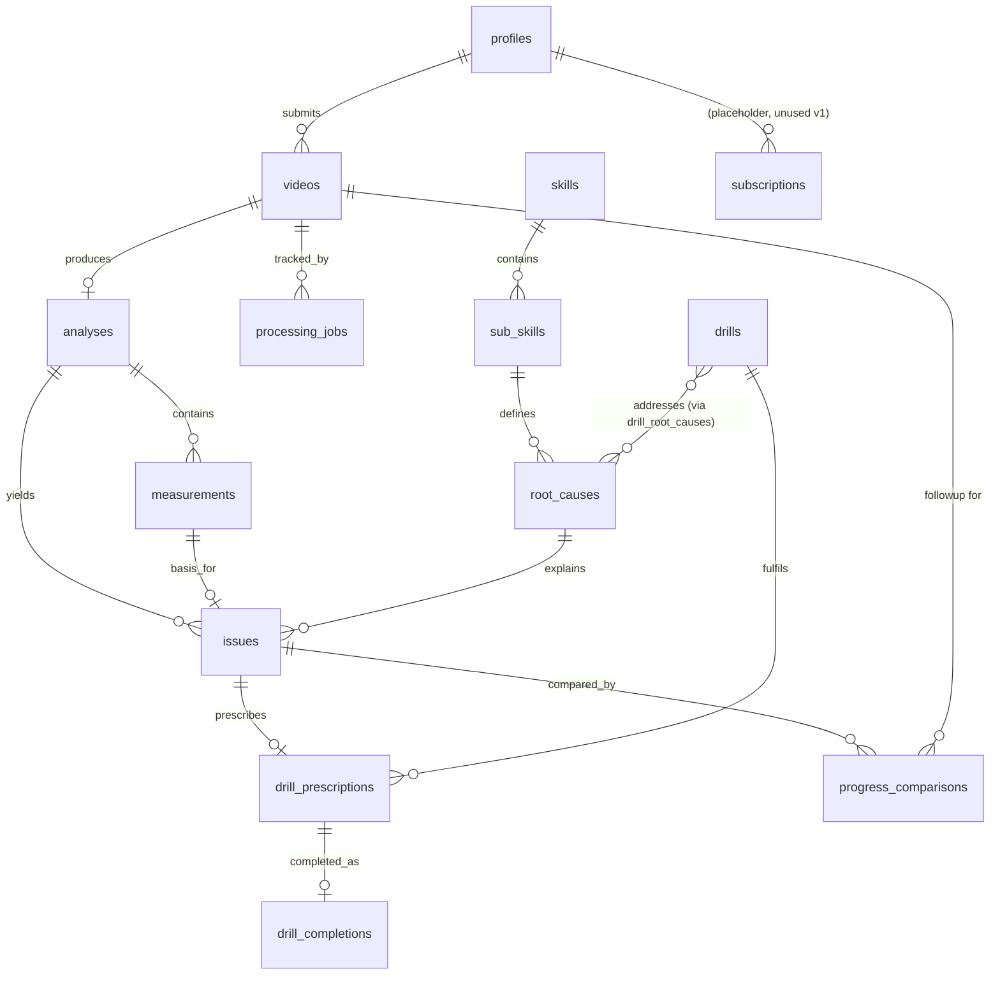

# 04 — Database

**Status:** Draft v1
**Depends on:** [03-system-architecture.md](./03-system-architecture.md), [02-software-requirements.md](./02-software-requirements.md)
**Feeds into:** [05-api.md](./05-api.md), [08-coaching-engine.md](./08-coaching-engine.md)

Postgres via Supabase. All tables live in the `public` schema unless noted. `auth.users` is Supabase-managed and referenced, not duplicated.

Large/binary data (video files, raw pose-landmark frames) lives in **Storage**, not Postgres — tables hold references (paths) and derived summary values only.

---

## 1. Tables

### `profiles`
Extends `auth.users` with the player profile (SR-PROF-001).

| Field | Type | Notes |
|---|---|---|
| `id` | uuid, PK | = `auth.users.id` |
| `display_name` | text | not null |
| `date_of_birth` | date | nullable if only age band provided |
| `age_band` | text | enum: `under_13`, `13_17`, `18_plus` — derived from DOB where known |
| `batting_hand` | text | enum: `left`, `right` |
| `playing_level` | text | enum: `junior_club`, `senior_club`, `school`, `other` |
| `is_minor` | boolean | generated from `age_band`; drives privacy defaults (SR-AUTH-004) |
| `created_at` | timestamptz | default `now()` |
| `updated_at` | timestamptz | default `now()` |

### `skills`
Future-proofing for disciplines beyond batting (§12 of [03-system-architecture.md](./03-system-architecture.md)). v1 seeds exactly one row: "Batting".

| Field | Type | Notes |
|---|---|---|
| `id` | uuid, PK | |
| `key` | text, unique | e.g. `batting` |
| `name` | text | |

### `sub_skills`
| Field | Type | Notes |
|---|---|---|
| `id` | uuid, PK | |
| `skill_id` | uuid, FK → `skills.id` | |
| `key` | text, unique | v1 seeds `front_foot_drive` only |
| `name` | text | |

### `root_causes`
The fixed taxonomy from [08-coaching-engine.md](./08-coaching-engine.md) §3.

| Field | Type | Notes |
|---|---|---|
| `id` | uuid, PK | |
| `sub_skill_id` | uuid, FK → `sub_skills.id` | |
| `key` | text, unique | e.g. `head_falling_away` |
| `name` | text | |
| `description` | text | plain-language definition used by SR-COACH-005 prompt construction |

### `videos`
| Field | Type | Notes |
|---|---|---|
| `id` | uuid, PK | |
| `player_id` | uuid, FK → `profiles.id` | not null |
| `storage_path` | text | Supabase Storage object path |
| `kind` | text | enum: `initial`, `followup` |
| `linked_issue_id` | uuid, FK → `issues.id`, nullable | required when `kind = followup` (SR-PROG-001) |
| `status` | text | enum: `uploaded`, `validating`, `rejected`, `analysing`, `complete`, `failed` (SR-VID-005) |
| `rejection_reason` | text, nullable | finite reason code, set when `status = rejected` (SR-VID-004) |
| `duration_seconds` | numeric | |
| `created_at` | timestamptz | default `now()` |

### `processing_jobs`
One row per pipeline stage attempt, for observability and resumability (§7 of [03-system-architecture.md](./03-system-architecture.md)).

| Field | Type | Notes |
|---|---|---|
| `id` | uuid, PK | |
| `video_id` | uuid, FK → `videos.id` | |
| `stage` | text | enum: `validate`, `extract_frames`, `pose_estimate`, `measure`, `diagnose`, `explain`, `match_drill`, `persist` |
| `status` | text | enum: `pending`, `running`, `succeeded`, `failed` |
| `error` | text, nullable | |
| `attempt_count` | int | default 0 |
| `started_at` | timestamptz, nullable | |
| `completed_at` | timestamptz, nullable | |

### `analyses`
One row per successfully analysed video (1:1 with `videos` where `status = complete`).

| Field | Type | Notes |
|---|---|---|
| `id` | uuid, PK | |
| `video_id` | uuid, FK → `videos.id`, unique | |
| `landmarks_storage_path` | text | raw per-frame pose landmarks, JSON, in Storage (SR-CV-004) |
| `measurement_formula_version` | text | version tag, e.g. `2026.08.1` (SR-CV-003) |
| `created_at` | timestamptz | default `now()` |

### `measurements`
| Field | Type | Notes |
|---|---|---|
| `id` | uuid, PK | |
| `analysis_id` | uuid, FK → `analyses.id` | |
| `marker_key` | text | enum: `head_stability`, `balance_weight_transfer`, `backlift_alignment`, `front_elbow_height`, `base_width`, `follow_through_shape` |
| `value` | numeric | |
| `unit` | text | e.g. `degrees`, `normalised_ratio` |
| `confidence` | numeric | 0.0–1.0 |
| `created_at` | timestamptz | default `now()` |

### `issues`
Output of SR-COACH-001/002/003. One analysis can produce multiple issue rows; exactly one is flagged primary.

| Field | Type | Notes |
|---|---|---|
| `id` | uuid, PK | |
| `analysis_id` | uuid, FK → `analyses.id` | |
| `measurement_id` | uuid, FK → `measurements.id` | |
| `root_cause_id` | uuid, FK → `root_causes.id` | |
| `severity` | numeric | 0.0–1.0, deterministic (SR-COACH-002) |
| `confidence` | numeric | 0.0–1.0 |
| `is_primary` | boolean | exactly one `true` per `analysis_id` (enforced — see Constraints) |
| `explanation_text` | text, nullable | LLM-generated, only populated for the primary issue (SR-COACH-005) |
| `created_at` | timestamptz | default `now()` |

### `drills`
| Field | Type | Notes |
|---|---|---|
| `id` | uuid, PK | |
| `title` | text | |
| `steps` | jsonb | ordered array of instruction steps |
| `equipment` | text, nullable | |
| `difficulty_level` | text | enum: `beginner`, `intermediate`, `advanced` |
| `media_url` | text, nullable | demonstration image/video |
| `created_at` / `updated_at` | timestamptz | |

### `drill_root_causes`
Join table — a drill can address more than one root cause and vice versa.

| Field | Type | Notes |
|---|---|---|
| `drill_id` | uuid, FK → `drills.id` | |
| `root_cause_id` | uuid, FK → `root_causes.id` | |
| | | PK is `(drill_id, root_cause_id)` |

### `drill_prescriptions`
| Field | Type | Notes |
|---|---|---|
| `id` | uuid, PK | |
| `issue_id` | uuid, FK → `issues.id`, unique | one prescription per issue (SR-COACH-006) |
| `drill_id` | uuid, FK → `drills.id` | |
| `prescribed_at` | timestamptz | default `now()` |

### `drill_completions`
| Field | Type | Notes |
|---|---|---|
| `id` | uuid, PK | |
| `prescription_id` | uuid, FK → `drill_prescriptions.id`, unique | |
| `completed_at` | timestamptz | (SR-DRILL-002) |

### `progress_comparisons`
Output of SR-PROG-002.

| Field | Type | Notes |
|---|---|---|
| `id` | uuid, PK | |
| `original_issue_id` | uuid, FK → `issues.id` | |
| `followup_video_id` | uuid, FK → `videos.id` | |
| `followup_measurement_id` | uuid, FK → `measurements.id` | |
| `verdict` | text | enum: `improved`, `no_material_change`, `regressed`, `inconclusive_low_confidence` |
| `delta_value` | numeric, nullable | null when verdict is inconclusive |
| `confidence` | numeric | 0.0–1.0 |
| `formula_version_mismatch` | boolean | true if original/follow-up used different measurement formula versions (SR-PROG-002) |
| `created_at` | timestamptz | default `now()` |

### `subscriptions` (placeholder — unused in v1)
Reserved so payments (§12 of [03-system-architecture.md](./03-system-architecture.md)) can be added without a schema migration that touches player data. No rows written by any v1 code path.

| Field | Type | Notes |
|---|---|---|
| `id` | uuid, PK | |
| `player_id` | uuid, FK → `profiles.id` | |
| `status` | text | |
| `plan` | text | |
| `created_at` | timestamptz | |

---

## 2. Relationships

## 3. Indexes

- `videos(player_id, created_at desc)` — history queries (SR-HIST-001).
- `videos(status)` — worker polling for in-progress jobs.
- `processing_jobs(video_id, stage)` — unique, one row per stage per video attempt cycle; also indexed for worker pickup by `status = pending`.
- `measurements(analysis_id, marker_key)`.
- `issues(analysis_id)`, `issues(analysis_id) where is_primary = true` (partial index, supports the one-primary-per-analysis constraint below).
- `drill_root_causes(root_cause_id)` — drill matching lookups (SR-COACH-006).
- `progress_comparisons(original_issue_id)`.

## 4. Constraints

- `issues`: partial unique index on `(analysis_id) WHERE is_primary = true` — guarantees SR-COACH-003's "exactly one primary issue" at the database level, not just in application logic.
- `videos`: check constraint `kind = 'followup' → linked_issue_id IS NOT NULL` (SR-PROG-001).
- `videos`: check constraint `status = 'rejected' → rejection_reason IS NOT NULL` (SR-VID-004).
- `measurements.confidence`, `issues.confidence`, `issues.severity`, `progress_comparisons.confidence` all constrained to `[0.0, 1.0]`.
- All foreign keys `ON DELETE CASCADE` from `profiles` downward — deleting a profile (SR-DATA-001) must cascade cleanly through videos → analyses → measurements/issues → drill_prescriptions/completions → progress_comparisons, with a corresponding application-level job to delete the matching Storage objects (cascade covers rows, not Storage — see §6).
- `drills` and taxonomy tables (`skills`, `sub_skills`, `root_causes`) are **not** owned by any player and are not cascade-deleted by player actions.

## 5. Row-Level Security

RLS is enabled on every table containing player data. Policy pattern:

- `profiles`: a user can `select`/`update` only where `id = auth.uid()`.
- `videos`, `analyses`, `measurements`, `issues`, `drill_prescriptions`, `drill_completions`, `progress_comparisons`: a user can `select` only rows that trace back (via join) to a `videos.player_id = auth.uid()`. No direct `insert`/`update`/`delete` from the client on `analyses`, `measurements`, `issues`, `drill_prescriptions`, or `progress_comparisons` — these are written exclusively by the Coordinator API's service-role connection, which bypasses RLS by design (it is the trusted pipeline writer, not a player-facing surface). Clients may `insert` `videos` (their own submission) and `insert` `drill_completions` (marking their own prescription complete).
- `drills`, `skills`, `sub_skills`, `root_causes`: publicly readable to authenticated users (reference/catalogue data), writable only by the service role.
- `subscriptions`: `select` own rows only; no client writes (placeholder, unused).

This is the primary authorisation boundary (§3 of [03-system-architecture.md](./03-system-architecture.md)) — the Coordinator API's own authorisation checks are defence-in-depth on top of RLS, not a substitute for it.

## 6. Data Retention

Governs both Postgres rows and Storage objects; full policy detail and legal basis in [11-security.md](./11-security.md).

| Data | Retention | Rationale |
|---|---|---|
| Video files (`videos-raw` bucket) | Retained while the account is active; deleted immediately on account deletion (SR-DATA-001) | Player-owned personal data; no retention need beyond the product's own re-measurement use case |
| Raw pose landmarks (`landmarks_storage_path`) | 12 months from creation, or account deletion, whichever is first | Allows re-derivation if a measurement formula is corrected (SR-CV-004); not needed indefinitely |
| Derived measurements/issues/comparisons (Postgres rows) | Retained while the account is active; deleted on account deletion | Forms the player's coaching history (SR-HIST-001) |
| `processing_jobs` rows | 90 days | Operational debugging only, not player-facing |

An automated job enforces the 12-month landmark expiry and the 90-day job-log expiry (SR-DATA-002); account deletion is immediate and event-driven, not batch.
