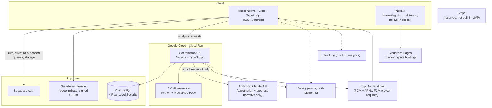

# 13 — Technology Decisions

**Status:** Draft v1 — formal evaluation superseding the informal assumptions flagged in [03-system-architecture.md](./03-system-architecture.md) §0. This document is the source of truth for stack decisions; §0 of that document should be updated to point here once this is approved (not done automatically — see §13 of this document).
**Depends on:** entire `/docs` directory, in particular [01-product-requirements.md](./01-product-requirements.md), [02-software-requirements.md](./02-software-requirements.md), [04-database.md](./04-database.md), [06-ai-architecture.md](./06-ai-architecture.md), [07-computer-vision.md](./07-computer-vision.md), [11-security.md](./11-security.md)
**No implementation changes accompany this document.** It is a decision record only.

## 0. Method

Every technology below is scored against the same nine criteria, not against how popular or familiar it is:

**MVP dev speed · AI integration · Video processing · Computer vision · Scalability · Cost · Developer experience · Security · Maintainability · App Store/Play Store deployment · Future global scale**

(eleven listed in the brief; grouped to nine sections below for readability without dropping any of them.)

Where a technology is rejected, the reason is stated in terms of these criteria and the product's actual constraints from [01-product-requirements.md](./01-product-requirements.md) — never "it's less popular."

---

## 1. React Native (+ Expo)

**1. What it does:** A framework for building native iOS/Android apps from a single TypeScript/JavaScript codebase, rendering true native UI components rather than a webview.

**2. Why Cricket AI needs it:** The core interaction — recording a side-on video with framing guidance ([09-ux-specification.md](./09-ux-specification.md) §5) — requires real native camera access, and the product is mobile-first by definition (NFR-04). A web app cannot deliver this experience credibly.

**3. Why selected:** One codebase covers both app stores at MVP team size, which is the dominant constraint right now (small team, tight loop, [01-product-requirements.md](./01-product-requirements.md) §1 scope discipline). React + TypeScript also matches the rest of the stack, so engineers move between mobile and backend code without a language switch.

**4. Alternatives considered:**
- **Native iOS (Swift) + Android (Kotlin) in parallel:** best possible camera/performance control, but doubles MVP build time and doubles the team needed to maintain it. Rejected for v1 — reconsider only if a specific native capability (e.g. on-device ML requiring platform-specific APIs) becomes a hard blocker.
- **Flutter:** comparable cross-platform capability and camera access, mature. Rejected only because it forces a second language (Dart) with no reuse against the TypeScript backend/coaching-engine logic, which matters less for UI code but adds hiring/context-switch friction for a small team standardising on TypeScript everywhere else.

**5. Advantages:** single codebase, near-native performance and camera access, huge ecosystem, direct TypeScript reuse of types/validation logic with the backend where useful (e.g. shared enums for `status`, `verdict`).

**6. Disadvantages:** camera/video edge cases (device fragmentation, especially older/low-end Android devices) are a real, ongoing maintenance cost; native module gaps occasionally require bridging.

**7. Migration risk:** Low to rewrite a specific screen in native code later if needed (RN supports native modules/bridging); high to abandon RN entirely for a full native rewrite — mitigate by keeping business logic (coaching-engine types, API client) out of UI components so it's portable.

**8. Cost considerations:** No direct licensing cost; cost is engineering time, which this choice minimises relative to dual-native.

**9. MVP vs future scale:** Suitable for both. Large consumer apps (Instagram, Discord, Shopify's merchant app) run RN at scale — this is not an MVP-only compromise.

### Expo (managed layer on top of React Native)

**1. What it does:** A toolchain and managed runtime around React Native — camera/media APIs, build service (EAS Build), OTA updates, push notification relay, dev client.

**2. Why needed:** Removes weeks of native build/signing/provisioning setup that has nothing to do with the actual product.

**3. Why selected:** Expo's "prebuild" model (since SDK 46+) generates native projects on demand, so the historical "Expo can't do custom native code" limitation is largely resolved — we get managed-workflow velocity without giving up native module access if a specific milestone needs it (e.g. a future on-device CV experiment, §7). EAS Build handles App Store/Play Store signing and submission (SR requirement: reliable deployment to both stores), which is otherwise a meaningful ongoing maintenance burden.

**4. Alternatives considered:** Bare React Native CLI (full control, no managed conveniences) — rejected for v1 because the team would be re-solving problems (build config, push setup, OTA) Expo has already solved well; **not rejected permanently** — bare RN remains a low-risk fallback if a specific native requirement ever outgrows Expo.

**5. Advantages:** fast setup, EAS Build/Submit for both stores from one config, OTA updates for non-native-code fixes (faster iteration than app-store review cycles for JS-only patches), built-in camera/media APIs matching exactly what's needed for [09-ux-specification.md](./09-ux-specification.md) §5.

**6. Disadvantages:** an extra abstraction layer to understand; a small number of native libraries still have rough edges under Expo's config plugin system.

**7. Migration risk:** Low — "ejecting" to bare RN is a supported, incremental path, not a rewrite.

**8. Cost considerations:** EAS Build/Submit has a free tier sufficient for early development; paid tiers scale with build volume/concurrency — a genuine but small and predictable line item, revisit at real usage.

**9. MVP vs future scale:** Ideal for MVP; large production apps run on Expo's managed workflow today, so this isn't a "swap it out later" decision.

---

## 2. TypeScript

**1. What it does:** A typed superset of JavaScript, compiled to JavaScript, that catches a large class of bugs (wrong shape of data, missing fields, incorrect enum values) at compile time instead of runtime.

**2. Why Cricket AI needs it:** The coaching engine's correctness depends on exact, consistent data shapes across the mobile app, Coordinator API, and database (measurement markers, root-cause keys, verdict enums — all cross-referenced throughout [02](./02-software-requirements.md)–[08](./08-coaching-engine.md)). A typo in a marker key silently producing `undefined` instead of a compile error is exactly the class of bug that would quietly break a diagnosis.

**3. Why selected:** Already the master-instructions default ("Use TypeScript wherever applicable"); reconfirmed here on the merits — shared types between the Coordinator API and mobile app (API request/response shapes from [05-api.md](./05-api.md)) eliminate an entire category of client/server contract bugs.

**4. Alternatives considered:** Plain JavaScript — rejected; the velocity gained by skipping type annotations is consistently outweighed, in a product with this much structured cross-service data, by the runtime bugs it lets through. Python for the mobile/API layer — not viable (no practical mobile framework), though Python is correctly used for the CV microservice (§6) where its ML ecosystem is unmatched.

**5. Advantages:** compile-time safety, superior editor tooling/autocomplete, self-documenting function signatures, shared types across the monorepo.

**6. Disadvantages:** build-step overhead (trivial with modern tooling), a learning curve for contributors unfamiliar with it.

**7. Migration risk:** N/A — this is a foundational choice, not one with a meaningful migration path away from.

**8. Cost considerations:** None (free, open source).

**9. MVP vs future scale:** Suitable for both, and the value compounds as the codebase and team grow.

---

## 3. Next.js

**1. What it does:** A React framework for building server-rendered/statically-generated web applications and APIs.

**2. Why Cricket AI needs it:** Not for the MVP mobile app — React Native (§1) owns that. Next.js's role is the **marketing/landing site** explicitly allowed in [01-product-requirements.md](./01-product-requirements.md) §8 ("minimal web app beyond a minimal marketing/landing site"), and it's the natural foundation for the future coach/academy dashboard ([00-product-vision.md](./00-product-vision.md) §11) when that's actually built.

**3. Why selected:** Excellent static-generation performance for a marketing site (SEO, load speed), and — the more important reason — when the coach/academy dashboard *is* built post-MVP, it can share TypeScript types and API client code with the mobile app and Coordinator API, rather than introducing a third, disconnected stack.

**4. Alternatives considered:** A plain static site (Astro, plain HTML) for the marketing page alone — genuinely simpler for a page with zero app logic, and worth reconsidering purely for the marketing site in isolation. Next.js is chosen anyway because the marketing site and the future dashboard are better served by one consistent web stack than by optimising the marketing page in isolation and rebuilding for the dashboard later.

**5. Advantages:** strong TypeScript support, flexible rendering strategies, large ecosystem, natural fit alongside the RN app's React/TypeScript conventions.

**6. Disadvantages:** meaningful overkill for a marketing page alone if the dashboard is delayed indefinitely — a cost worth naming honestly, not hiding.

**7. Migration risk:** Low — a Next.js marketing site can be replaced by a simpler static site later with no impact on the mobile app or backend; nothing else depends on it.

**8. Cost considerations:** Free/open source; hosting cost depends on platform (§5 addresses Cloudflare Pages as the selected host).

**9. MVP vs future scale:** **Not MVP-critical** — no v1 feature in [01-product-requirements.md](./01-product-requirements.md) requires it beyond an optional marketing page. Explicitly deferred: build only when the marketing site or coach dashboard is actually prioritised, not as part of the MVP loop milestones ([roadmap/00-mvp.md](../roadmap/00-mvp.md)).

---

## 4. Backend Platform — Supabase vs Firebase

This is the single highest-leverage decision in the stack, because it shapes the database, auth, storage, and authorization model simultaneously. Evaluated head-to-head rather than as independent line items.

**1. What they do:** Both are "Backend-as-a-Service" platforms bundling a database, authentication, file storage, and serverless functions, aimed at exactly the kind of team that doesn't want to hand-roll all four. Supabase is built on **Postgres** (relational, SQL); Firebase's primary database (Firestore) is a **NoSQL document store**.

**2. Why Cricket AI needs one of them:** Hand-rolling auth, storage, and a database from scratch is pure time cost with no product differentiation for an MVP — see [01-product-requirements.md](./01-product-requirements.md)'s scope discipline. The real question is which model fits our data.

**3. Why Supabase was selected:** Cricket AI's data is **deeply relational by nature**, not incidentally — a video has an analysis, which has measurements, which produce issues, each tied to a root cause and a versioned formula, prioritised into exactly one primary issue, prescribing exactly one drill, compared against a follow-up ([04-database.md](./04-database.md) §1–2). This schema leans on:
   - **Foreign keys and check constraints** to make invariants unbreakable at the data layer — e.g. the partial unique index enforcing "exactly one primary issue per analysis" ([04-database.md](./04-database.md) §4), or "a `followup` video must reference a `linked_issue_id`." Firestore has no equivalent to a SQL check constraint or a partial unique index; these invariants would have to be enforced entirely in application code, which is strictly weaker (a bug or a direct console edit can violate them).
   - **Row-Level Security (Postgres native)** as the primary authorization boundary ([04-database.md](./04-database.md) §5, [11-security.md](./11-security.md) §2) — SQL predicates over joined tables ("a user can read this `issue` row if it traces back through `videos.player_id = auth.uid()`") are naturally expressive in RLS. Firestore Security Rules *can* express per-document ownership, but multi-hop relational authorization (issue → analysis → video → player) is significantly more awkward to write and audit correctly in Firestore's rules language, and gets more error-prone exactly as the schema grows — the opposite direction we want risk trending.
   - **SQL for the calibration and analytics work in [roadmap/13-threshold-calibration-and-launch-readiness.md](../roadmap/13-threshold-calibration-and-launch-readiness.md)** — comparing coach-labelled outcomes against system output across measurement distributions is a natural SQL aggregation query; the equivalent in Firestore usually means exporting to BigQuery first.
   - **Postgres portability** — Supabase is "managed Postgres plus a productivity layer," not a proprietary data format. If we ever need to leave Supabase (cost, control, a specific enterprise requirement), the database itself migrates to any Postgres host (AWS RDS, GCP Cloud SQL, self-hosted) with standard tooling. Firestore has no comparable exit path — leaving Firebase means a real data-model rewrite, not a `pg_dump`.

**4. Alternatives considered:**
   - **Firebase**, evaluated seriously, not dismissed on reputation: its real strengths are Firestore's offline-first mobile sync (genuinely better out-of-the-box than Supabase Realtime for offline scenarios) and its maturity/ecosystem size. Both are secondary to Cricket AI's actual needs — the app is not offline-first (a video needs connectivity to upload and be analysed regardless), so Firestore's flagship advantage isn't decisive here, while the relational-integrity and RLS advantages above are decisive.
   - **A fully custom backend** (raw Postgres + hand-rolled auth, e.g. on AWS RDS with a custom auth service): more control, but reproduces Supabase's auth/storage/RLS-tooling from scratch for no MVP-stage benefit. Revisit only if Supabase's managed layer becomes a genuine constraint at scale (§9).
   - **Hasura or PostgREST directly on a self-managed Postgres instance:** viable, Postgres-native alternative giving similar RLS-based authorization without Supabase's hosting; rejected for MVP purely on setup/maintenance overhead versus Supabase's integrated Auth+Storage+DB+dashboard, revisit as a self-hosting path if ever needed (low migration risk, since the schema/RLS model transfers directly — see §7).

**5. Advantages (Supabase):** relational integrity matching our actual data shape, RLS as a strong default-deny security boundary, standard Postgres (portable, huge tooling/hiring ecosystem, SQL is a durable skill), integrated Auth + Storage + realtime + edge functions in one project, generous free/hobby tier for MVP development.

**6. Disadvantages (Supabase):** younger platform than Firebase with a smaller managed-service track record at extreme scale; Supabase Realtime is capable but less battle-tested for complex offline sync than Firestore's; fewer global regions historically than Firebase/GCP (worth re-checking at the point international expansion is real, not now).

**7. Migration risk:** **Low**, specifically because the underlying engine is standard Postgres — the highest-value insurance policy in this entire stack decision. A future move to self-hosted Postgres or another managed Postgres provider is a database migration, not a data-model rewrite.

**8. Cost considerations:** Free tier covers MVP development and early beta comfortably; paid tier scales predictably with database size/bandwidth/monthly active users — materially cheaper than Firestore's per-document-read/write pricing model would likely be for our access pattern (the coaching-engine flow reads across several joined tables per screen load — in Firestore that's several separate document reads billed individually; in Postgres it's one query).

**9. MVP vs future scale:** Suitable for both, with the portability argument (§7) specifically protecting the "future global scale" criterion — we are not locked into Supabase's own scaling ceiling if we ever need to leave.

---

## 5. PostgreSQL

**1. What it does:** The open-source relational database engine underlying Supabase (§4).

**2. Why Cricket AI needs it:** It's the concrete technology that makes every advantage in §4 real — RLS, foreign keys, check constraints, partial unique indexes are Postgres features Supabase exposes, not Supabase inventions.

**3. Why selected:** A direct consequence of §4; called out separately here because it's the actual portability guarantee — "we use Supabase" and "we use Postgres" are different claims, and the second one is what protects us from vendor lock-in.

**4. Alternatives considered:** MySQL/MariaDB (viable relational alternative, weaker native RLS story — Postgres RLS is more mature and is exactly what Supabase is built around); this is effectively resolved by §4, not an independent decision.

**5. Advantages:** mature, standards-compliant SQL, exceptional extension ecosystem (e.g. `pgvector` if any future embedding/similarity-search need arises — plausible for a future "similar issue patterns across players" feature, not needed in v1), enormous hiring pool of SQL-literate engineers.

**6. Disadvantages:** none specific to this product beyond the general operational overhead of running a relational database at very large scale (sharding, connection pooling) — a real but distant concern (§9).

**7. Migration risk:** Minimal within the Postgres ecosystem (§4 §7); the risk that matters is *not* being on Postgres, which we've avoided.

**8. Cost considerations:** Covered under Supabase pricing (§4); self-hosting Postgres directly (bypassing Supabase) trades a monthly platform fee for infrastructure/ops time — not worth it before real scale pressure exists.

**9. MVP vs future scale:** Proven at massive scale industry-wide (Postgres runs some of the largest applications in the world); not an MVP-only compromise.

---

## 6. Cloud / Compute Hosting — Google Cloud vs AWS vs Cloudflare

The Coordinator API and CV microservice ([03-system-architecture.md](./03-system-architecture.md) §3) need a compute host. This was left an open placeholder ("Fly.io or Render") in the earlier draft — resolved here properly against the three platforms the brief asked to evaluate.

**1. What they do:** All three are general-purpose cloud platforms; the relevant service class for us is **containerised compute for stateless services** (run our Docker images, autoscale, handle HTTPS).

**2. Why Cricket AI needs one:** The Coordinator API (Node/TypeScript orchestration) and the CV microservice (Python/MediaPipe) both need to run continuously-available, containerised, autoscaling compute outside of Supabase's scope (§4's "why not put everything in Edge Functions" rationale in [03-system-architecture.md](./03-system-architecture.md) §3 still holds).

**3. Why Google Cloud (Cloud Run) was selected:**
   - **Cloud Run is a near-perfect fit for exactly our two services**: fully managed, containerised, autoscales to zero (no idle cost between video submissions during early low-traffic MVP usage — directly serves the "Cost" criterion) and scales up under load without capacity planning.
   - **MediaPipe is a Google technology.** This isn't a superficial branding coincidence: GCP's container tooling, documentation, and example deployments for MediaPipe-based services are first-party and well-maintained, reducing integration friction specifically for the CV microservice (§7 below).
   - Deploy-from-Dockerfile simplicity matches the "MVP dev speed" criterion better than AWS's equivalent (ECS/Fargate requires materially more upfront configuration — task definitions, cluster setup, VPC networking decisions) for a small team that wants to ship, not administer infrastructure.
   - Google Cloud's free tier and Cloud Run's pay-per-request pricing keep early-stage cost predictable and low, addressed further in §8.

**4. Alternatives considered:**
   - **AWS** (ECS/Fargate or Lambda): the most mature, most complete platform, with the deepest bench of managed services for eventual scale (RDS, SageMaker, Rekognition, CloudFront, global infrastructure breadth). Evaluated seriously — this is the safe "everyone hires for it" choice — but rejected **for MVP specifically** because its operational surface area (VPCs, IAM policy complexity, ECS task/service configuration) is a poor match for a small team optimising for shipping speed right now. This is not a permanent rejection: AWS remains a strong candidate if Cricket AI later needs a specific AWS-only capability (e.g. SageMaker for a future custom cricket-CV model, [07-computer-vision.md](./07-computer-vision.md) §5/§6) or an enterprise customer requires it.
   - **Cloudflare** (Workers): excellent for edge-delivered, low-latency, lightweight compute — but Workers' CPU-time and runtime constraints make it a poor fit for the CV microservice's actual workload (loading MediaPipe's model weights, running inference across dozens of frames per video, in Python — Workers' Python support is WASM/Pyodide-based and not designed for native ML dependencies like MediaPipe's). Cloudflare is **not rejected outright** — it's selected for a different, better-fitted role (§ below: CDN and, at scale, object storage egress).
   - **Fly.io / Render** (the earlier placeholder): both remain genuinely reasonable, simpler alternatives for a very small team, and are worth naming honestly as close competitors — the deciding factor against them here is that Cloud Run's autoscale-to-zero pricing model and first-party MediaPipe alignment give a slightly better cost and integration story for our specific two-service shape, not that either alternative is deficient.

**5. Advantages (Cloud Run):** scale-to-zero cost efficiency, fast container deploys, generous free tier, strong fit with MediaPipe/Python tooling, straightforward path to add more services (e.g. a future dedicated worker for the Postgres job queue, [03-system-architecture.md](./03-system-architecture.md) §0.5) without re-architecting.

**6. Disadvantages:** cold starts on scale-from-zero can add latency to the first request after idle — worth monitoring against the 3-minute NFR-01 budget, though this affects request initiation, not the (already asynchronous) processing pipeline itself; smaller managed-service catalogue than AWS if a future need calls for something GCP doesn't offer natively.

**7. Migration risk:** Low-to-moderate — both services are already specified as portable Docker containers ([03-system-architecture.md](./03-system-architecture.md) §14), so moving to AWS Fargate, Fly.io, or Render later is a redeploy-target change, not a rewrite, provided we avoid GCP-proprietary APIs inside application code (a discipline to hold deliberately, not incidentally).

**8. Cost considerations:** Pay-per-request/compute-time with scale-to-zero is close to free at MVP traffic levels; costs become meaningful and worth actively monitoring once video volume grows — track per-analysis cost (NFR-08) from day one so this is measured, not assumed.

**9. MVP vs future scale:** Strong MVP fit; large-scale suitability is good but not unlimited — very high, sustained throughput may eventually favour a more manually-tuned AWS/GCE or Kubernetes setup. Not a decision that needs to be made now (§9 of [03-system-architecture.md](./03-system-architecture.md) already frames this as a "replace when volume demands it" component).

### Cloudflare's actual role

Selected narrowly, not for compute: **Cloudflare Pages** hosts the Next.js marketing site (§3) — fast global edge delivery for a mostly-static site is exactly Cloudflare's strength. **Cloudflare R2** (S3-compatible storage with zero egress fees) is flagged as a **future cost optimisation** for video/media delivery once Supabase Storage's bandwidth costs become material at scale — not adopted on day one, to avoid fragmenting the auth-integrated signed-URL model in [04-database.md](./04-database.md) §6 across two storage systems before there's a real cost reason to.

---

## 7. AI Language Layer — Anthropic vs OpenAI

**1. What it does:** A hosted large language model API used exclusively for the two structured, schema-constrained text-generation call sites defined in [06-ai-architecture.md](./06-ai-architecture.md) §2 — issue explanation and progress narrative. It never measures, diagnoses, or decides anything (§3 of that document).

**2. Why Cricket AI needs one:** Turning structured facts (a measurement, a root cause, a severity, a confidence score) into a clear, age-appropriate, honest explanation is a genuine natural-language generation problem that deterministic code shouldn't attempt — this is the one place in the pipeline where an LLM is the right tool (§1 of [06-ai-architecture.md](./06-ai-architecture.md)).

**3. Why Anthropic (Claude) was selected:** This is a closer call than §4 or §6, and is named as such rather than overstated. The deciding factors, specific to how this call site is actually used:
   - The product's core honesty requirement (NFR-05: never present low-confidence output as certain; never let the model state a fact not present in its structured input) is a **grounded, schema-constrained generation** problem, and Claude's tool-use/structured-output behaviour is reliable and well-suited to exactly this constrained pattern.
   - The target audience skews young (ages 12–18, [00-product-vision.md](./00-product-vision.md) §3) and the product must communicate uncertainty carefully rather than overstate confidence — Claude's training emphasis on calibrated, careful, non-overclaiming responses is a good fit for the tone this specific feature needs, more than a generic "which model is smarter" comparison would capture.
   - **Practically, for this project specifically:** the coaching-engine architecture already commits to a schema-first, low-temperature, single-purpose prompt pattern (§2 of [06-ai-architecture.md](./06-ai-architecture.md)) that either provider's structured-output feature supports well — meaning switching later is a genuinely low-risk, contained change (§7 below), which lowers the stakes of this decision considerably.

**4. Alternatives considered:** **OpenAI (GPT models)** — a fully comparable, highly capable alternative with mature function-calling/JSON-mode structured output, a broad ecosystem, and (depending on model tier) potentially lower cost at scale. This is not a case of OpenAI being unsuitable; it's a genuinely close call decided on the tone/calibration fit above. If future pricing, latency, or a specific capability gap makes OpenAI clearly better for this call site, the migration cost is low precisely because the input/output contract is already abstracted behind a schema (§7).

**5. Advantages (Anthropic):** strong structured/tool-use output reliability, careful and calibrated tone well-matched to a youth-skewing coaching product, straightforward API integration.

**6. Disadvantages:** smaller ecosystem of third-party tooling/examples than OpenAI's; pricing and rate limits need to be checked against actual per-analysis call volume as usage grows (§8).

**7. Migration risk:** **Low**, by design — the architecture in [06-ai-architecture.md](./06-ai-architecture.md) §2 treats the model as a swappable component behind a fixed structured-input/structured-output contract; the "hard constraints" in §3 of that document (no raw video/facts beyond the structured input, schema-validated output, safe fallback) hold regardless of which provider sits behind the call. Model version is explicitly pinned, not floated (§2), so any provider or version change is a deliberate, tested change, not silent drift.

**8. Cost considerations:** Both call sites are short, structured, low-token generations (not long-form chat) — cost per analysis should be small and directly trackable per NFR-08; exact pricing should be confirmed against current published rates at implementation time (roadmap milestone 08, [roadmap/08-ai-coaching-explanation.md](../roadmap/08-ai-coaching-explanation.md)) rather than assumed here.

**9. MVP vs future scale:** Suitable for both — the constrained, structured-input pattern this architecture uses doesn't get more expensive or fragile as volume grows in a way that would force a rearchitecture, only a cost-optimisation review.

---

## 8. Computer Vision — MediaPipe vs MoveNet vs Alternatives

**1. What it does:** Pose estimation — extracting body landmark coordinates (joints) from video frames, the technical foundation for every technique measurement in [07-computer-vision.md](./07-computer-vision.md) §8.

**2. Why Cricket AI needs it:** It's the entire "ANALYSE" step of the core loop and the only source of the six v1 technique measurements — nothing about the coaching engine works without accurate, confidence-scored landmark data.

**3. Why MediaPipe Pose was selected:**
   - v1's pipeline is **server-side, asynchronous, batch processing** of a submitted video ([03-system-architecture.md](./03-system-architecture.md) §7) — not real-time, on-device tracking. This matters directly for the MoveNet comparison below.
   - MediaPipe's Pose Landmarker outputs **33 landmarks including z-depth/rotation information**, versus a leaner 17-point COCO-format output from MoveNet — the richer output gives more headroom for the measurement formulas in [07-computer-vision.md](./07-computer-vision.md) §8 (e.g. `backlift_alignment`'s angle calculation benefits from more precise joint data than the minimum 17-point set strictly requires).
   - MediaPipe ships as a complete, well-documented Python pipeline (not just a bare model) with built-in visibility/confidence scoring per landmark — directly what SR-CV-002 requires — reducing custom integration work versus assembling an equivalent pipeline around a bare MoveNet model.
   - Apache 2.0 licence — unambiguous for commercial use, self-hosted, at no cost, keeping player video inside our own infrastructure ([11-security.md](./11-security.md) §4) rather than a third-party CV vendor.

**4. Alternatives considered:**
   - **MoveNet** (Google, TF.js/TFLite, 17 COCO keypoints, Lightning/Thunder variants): genuinely the better choice **if** Cricket AI later builds real-time, on-device feedback (e.g. a live camera overlay showing pose tracking *during* recording, not just after submission) — MoveNet is specifically optimised for that low-latency, on-device use case. **Explicitly flagged as the right technology for that specific future feature, not a rejected option overall** — different problem, different tool.
   - **ML Kit Pose Detection** (Google, on-device mobile only): same family as MoveNet in practice, same "on-device real-time" fit, same reasoning as above — not usable for our current server-side Python pipeline.
   - **OpenPose / AlphaPose** (academic-origin models): capable, but OpenPose in particular carries commercial-use licensing restrictions requiring a separate commercial licence for certain uses — a real legal/cost risk not worth taking on when MediaPipe offers comparable capability under a clean Apache 2.0 licence. Also generally heavier/GPU-dependent, working against the Cloud Run cost model (§6).
   - **YOLO-pose (Ultralytics):** fast and capable, but licensing (AGPL for the open version, commercial licence required otherwise) again adds cost/legal complexity MediaPipe avoids outright.
   - **Third-party sports-biomechanics CV APIs:** already evaluated and rejected in [07-computer-vision.md](./07-computer-vision.md) §0/§6 — vendor lock-in, per-analysis cost, less control over the exact measurements needed, and player video leaving our infrastructure. Revisit only if in-house accuracy provably can't hit calibration targets in [roadmap/13-threshold-calibration-and-launch-readiness.md](../roadmap/13-threshold-calibration-and-launch-readiness.md).
   - **Apple Vision framework (body pose):** iOS-only — rejected outright, since it would fragment the cross-platform pipeline and can't serve Android users at all.

**5. Advantages (MediaPipe):** free, self-hosted, rich 33-point landmark output with confidence scores, mature Python SDK, no per-request vendor cost, actively maintained by Google, no data leaves our infrastructure.

**6. Disadvantages:** general-purpose (not cricket-trained) — it tracks the human body accurately but has no cricket-specific concept of a bat or ball (already documented honestly in [07-computer-vision.md](./07-computer-vision.md) §5–6, not a MediaPipe limitation specifically but a limitation of pose estimation generally); accuracy degrades under occlusion/motion blur/poor lighting, tracked via confidence scoring rather than hidden.

**7. Migration risk:** Low at the architecture level — the CV microservice exposes a stable internal contract (landmarks/measurements in, per [03-system-architecture.md](./03-system-architecture.md) §9) regardless of which model sits behind it; swapping MediaPipe for a future custom-trained model (§12 of [07-computer-vision.md](./07-computer-vision.md)) replaces internals, not the contract.

**8. Cost considerations:** No licensing cost; the real cost is compute time to run inference per video, which is the actual variable driving the Cloud Run cost model (§6) and the NFR-08 per-analysis cost tracking requirement.

**9. MVP vs future scale:** Right for MVP's server-side batch pipeline; MoveNet becomes the right choice specifically if/when a real-time on-device feature is built — a clean, well-understood future fork, not a limitation of today's choice.

---

## 9. Stripe (future — not MVP)

**1. What it does:** Payment processing and subscription billing infrastructure.

**2. Why Cricket AI needs it:** Not yet — no v1 feature requires payments ([01-product-requirements.md](./01-product-requirements.md) §8 explicitly excludes it). Documented here because the database already reserves a placeholder ([04-database.md](./04-database.md) `subscriptions` table) for it.

**3. Why selected (for future use, not now):** Best-in-class developer experience, mature React Native SDK, strong fit with a Supabase-based stack (well-documented integration patterns), broad global payment method support relevant to "future global scale."

**4. Alternatives considered:** **Paddle** (and similar merchant-of-record providers) — genuinely worth reconsidering when payments is actually built: as a merchant-of-record, Paddle handles global VAT/GST/sales-tax compliance directly, which is a real, recurring operational burden Stripe's own tooling (Stripe Tax) reduces but doesn't fully remove. For a product with explicit international ambition ([00-product-vision.md](./00-product-vision.md) §11), this is a legitimate reason to revisit at that time rather than defaulting to Stripe reflexively.

**5–9.** Deferred in full until payments is prioritised — evaluating advantages/disadvantages/cost in depth now would be speculative. The one firm decision made here: **do not build any payment code, keys, or UI in the MVP** (already stated in [01-product-requirements.md](./01-product-requirements.md) §8 and [03-system-architecture.md](./03-system-architecture.md) §12; reaffirmed, not changed, by this document).

---

## 10. Expo Notifications

**1. What it does:** A unified push-notification API (wrapping APNs for iOS and FCM for Android) integrated with the Expo toolchain (§1).

**2. Why Cricket AI needs it:** The one notification in MVP scope — "your analysis is ready" ([03-system-architecture.md](./03-system-architecture.md) §10, a Should-have per [01-product-requirements.md](./01-product-requirements.md) §6) — needs a reliable way to reach a player who's backgrounded the app during processing.

**3. Why selected:** Already using Expo (§1); Expo Notifications is the path of least friction for a single, simple notification type, with no separate vendor SDK to integrate.

**4. Alternatives considered:** **OneSignal** — more powerful (segmentation, campaigns, richer analytics) but solving problems Cricket AI doesn't have in v1 (no notification campaigns — explicitly excluded, [01-product-requirements.md](./01-product-requirements.md) §8). Worth revisiting specifically if/when drill-reminder nudges or broader engagement campaigns are prioritised post-MVP.

**Important operational note, not a vendor decision:** Expo's push service requires **Android push credentials from a Firebase Cloud Messaging (FCM) project** — Google deprecated the legacy shared FCM key in favour of per-project service-account credentials. This means a **free Firebase project is required purely for FCM credentials**, even though Firebase is explicitly not our backend platform (§4). This is a narrow, unavoidable operational dependency, not a reason to reconsider §4's decision, and should be scoped in [roadmap/01-project-foundation.md](../roadmap/01-project-foundation.md) setup, not treated as a surprise later.

**5. Advantages:** minimal integration work given Expo is already the mobile framework, one API for both platforms.

**6. Disadvantages:** less feature-rich than a dedicated push/engagement platform if notification needs grow.

**7. Migration risk:** Low — a thin notification-sending layer, easily swapped for OneSignal or a direct FCM/APNs integration later without touching the rest of the app.

**8. Cost considerations:** Free at MVP scale.

**9. MVP vs future scale:** Right for MVP's single notification type; revisit if/when notification scope genuinely grows (explicitly out of MVP per [01-product-requirements.md](./01-product-requirements.md) §8).

---

## 11. Sentry

**1. What it does:** Error tracking and crash/exception monitoring, with release tracking and source-map symbolication.

**2. Why Cricket AI needs it:** NFR-02 requires that pipeline failures never go silent; Sentry is how engineering actually finds out about them in production, on both the mobile app and the Coordinator API/CV microservice.

**3. Why selected:** Best-in-class React Native support (a real differentiator — mobile crash symbolication is notoriously fiddly and Sentry's RN SDK handles it well), unified error tracking across the mobile app and both backend services in one dashboard, generous free tier for MVP volume.

**4. Alternatives considered:** Bugsnag, Rollbar — both capable, comparable feature sets; Sentry selected for its RN-specific maturity and because it's already the de facto default referenced in [03-system-architecture.md](./03-system-architecture.md) §13, and switching would have no product benefit to justify the churn.

**5. Advantages:** strong mobile SDK, correlates errors across services via a shared correlation ID (already designed into the pipeline, [03-system-architecture.md](./03-system-architecture.md) §13), fast setup.

**6. Disadvantages:** cost scales with event volume at larger scale — worth monitoring, not a concern at MVP volume.

**7. Migration risk:** Low — error-tracking SDKs are thin, swappable integration points.

**8. Cost considerations:** Free tier sufficient for MVP; paid tiers scale with event volume.

**9. MVP vs future scale:** Suitable for both.

---

## 12. Analytics — PostHog

**1. What it does:** Product analytics — event tracking, funnels, retention, session replay, feature flags.

**2. Why Cricket AI needs it:** The entire point of the MVP is a specific behavioural loop (record → diagnose → drill → follow-up → verdict, [00-product-vision.md](./00-product-vision.md) §6); the team needs to see, with real data, where players drop out of that loop — this is a product-management necessity, not a nice-to-have.

**3. Why selected:** Purpose-built funnel/retention analysis (exactly the "is the core loop being completed" question), open-source and self-hostable (data ownership, relevant given the sensitivity of the surrounding product per [11-security.md](./11-security.md)), feature flags available for future experimentation (e.g. A/B testing drill copy or onboarding flow) without adding another vendor later.

**4. Alternatives considered, honestly:** **Firebase Analytics** is a real counter-argument worth naming directly — since §10 already requires a free Firebase project for FCM push credentials, Firebase Analytics would be "free and already there." It's rejected anyway because its feature depth for funnel/retention analysis is materially behind PostHog's without additional BigQuery export setup (itself added cost/complexity), and it nudges toward deeper Firebase/Google ecosystem entanglement that §4 deliberately avoided for good reasons. **Amplitude/Mixpanel** — comparable product-analytics depth to PostHog, but neither is self-hostable and both get expensive faster at scale; PostHog's open-source option keeps a future self-host path open if cost or data-residency ever demands it.

**5. Advantages:** funnel-first analysis matching exactly what the product needs to measure, self-hostable if ever required, generous free tier, feature flags included.

**6. Disadvantages:** smaller ecosystem/community than Amplitude or Mixpanel; session replay and some advanced features are less polished than dedicated tools in that specific niche.

**7. Migration risk:** Low-moderate — event-tracking calls are a thin instrumentation layer; switching providers means re-pointing the SDK and re-building dashboards, not a data-model change.

**8. Cost considerations:** Free tier covers MVP-scale event volume; self-hosting remains available as a cost lever at larger scale.

**9. MVP vs future scale:** Suitable for both.

---

## 13. Final Recommended Architecture

### Confirmed / revised against [03-system-architecture.md](./03-system-architecture.md) §0

| # | Original assumption | Outcome |
|---|---|---|
| 1 | Supabase over Firebase/custom backend | **Confirmed**, now with full head-to-head rationale (§4) |
| 2 | React Native/Expo, TypeScript | **Confirmed** (§1) |
| 3 | Self-hosted MediaPipe over paid CV API | **Confirmed**, MoveNet evaluated and reserved for a future real-time/on-device feature, not chosen now (§8) |
| 4 | Anthropic Claude for explanation generation | **Confirmed**, acknowledged as the closest call in the stack, with OpenAI as a low-risk swap-in if warranted later (§7) |
| 5 | Postgres-backed job table over managed queue | **Unchanged** — not in this evaluation's scope; still the right MVP-scale call per [03-system-architecture.md](./03-system-architecture.md) §0.5 |
| — | Coordinator API/CV microservice host: "Fly.io or Render, undecided" | **Resolved: Google Cloud Cloud Run** — new decision, not previously made (§6) |
| — | Marketing site framework: unspecified | **Resolved: Next.js on Cloudflare Pages**, explicitly deferred and not MVP-critical (§3, §6) |

### What did *not* change
Database schema, API contracts, coaching-engine logic, and UX specification are all host/vendor-agnostic by design and require **no changes** as a result of this document — confirming that [04-database.md](./04-database.md) through [12-testing.md](./12-testing.md) were written at the right level of abstraction.

### Required follow-up (not performed as part of this document, per instruction)
Once this document is approved: update [03-system-architecture.md](./03-system-architecture.md) §0 and §14 to reference this document as the resolved decision record instead of carrying its own now-superseded "Fly.io or Render" placeholder, and update [roadmap/01-project-foundation.md](../roadmap/01-project-foundation.md) to name Cloud Run and the FCM-credentials requirement (§10) explicitly. No implementation work begins until you confirm this document.
